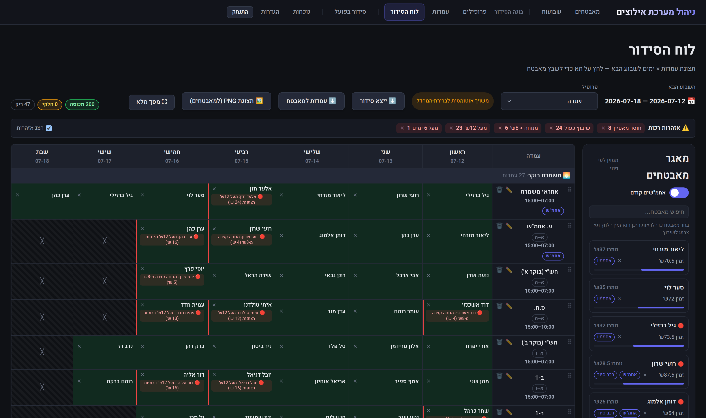

# 🛡️ Ilutzim · אילוצים

**End-to-end workforce scheduling, availability & attendance for security teams** — from the moment a guard submits weekly availability in Telegram, to the payroll report on the accountant's desk. One pipeline, one source of truth, zero manual re-keying.


[](https://github.com/yosefco3/ilutzim-shift-management/actions/workflows/ci.yml)


## ✨ [View the full project showcase →](https://yosefco3.github.io/ilutzim-shift-management/)

> A visual tour with live screenshots, architecture, and feature deep-dives.
> *(Served from [`docs/index.html`](docs/index.html) via GitHub Pages.)*

[](https://yosefco3.github.io/ilutzim-shift-management/)

*The scheduling board: selecting a guard paints the grid by their real submitted availability; a live warning engine flags conflicts and fatigue risks — it warns, it never blocks. (Demo data.)*

---

## The pipeline

| # | Stage | What happens |
|---|-------|--------------|
| 1 | **Availability submission** | Guards report weekly availability in a Telegram Web App — no extra app, no passwords |
| 2 | **Constraints workbook** | Styled, color-coded RTL Excel export of all submissions — round-trip importable |
| 3 | **Scheduling board** | Availability paints the board; manual assignment with 9 live soft warnings |
| 4 | **Publish & lock** | Personal Telegram message + schedule PNG per guard; locking is automatic (rollover) |
| 5 | **Actual schedule** | An editable 1:1 copy of the plan for the running week — last-minute swaps, retroactive fixes |
| 6 | **Attendance & comparison** | Two-tap Telegram punch clock, cross-checked minute-by-minute against the actual schedule |
| 7 | **Payroll workbooks** | Payroll-bureau-ready Excel reports: standard vs. actual hours, fully transparent |

## Architecture

```
Telegram Bot (aiogram)        React 19 + Vite (admin + guards)
        └──────────────┬──────────────┘
                       ▼  REST API
        FastAPI — Controllers → Services → Repositories → Models
        domain packages: availability → schedule builder → attendance
        (one-way dependency boundary)
                       ▼
        PostgreSQL + Alembic (20+ migrations, DB-level rule enforcement)
```

**Engineering principles:** soft warnings over hard blocks · a single read-model shared by screen, Excel, PNG and Telegram · every major feature ships dark behind a feature flag · self-healing schedulers with startup catch-up · append-only audit for attendance · 1,200+ automated tests (pytest + Vitest, golden-fixture parity between the Python and JS warning engines).

## Stack

Python 3.12 · FastAPI · SQLAlchemy (async) · PostgreSQL · Alembic · aiogram 3 · React 19 · Vite · pytest · Vitest · Docker · Railway

---

Built by **Yosef Cohen** · 2026. The product UI is Hebrew (RTL); screenshots use demo data.
